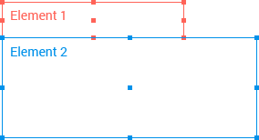
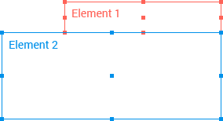

# Popup Overview

The Kendo UI Popup is a component that positions a content next to a specific anchor component.

**Figure 1: A left-aligned template of the Popup**



## Default Setup

```html-preview
  <style>
      .content {
        padding: 10px;
        color: #787878;
        background-color: #fcf7f8;
        font-size: 13px;
        font-family: Helvetica, Arial, sans-serif;
        letter-spacing: 1px;
        text-align: center;
        border: 1px solid rgba(0,0,0,.05);
      }

      .anchor {
        width: 80px;
        height: 40px;
      }

      .popup {
        width: 100px;
        height: 70px;
      }
  </style>
  <div id="app"></div>
```
```jsx
    class BasicDemo extends React.Component {
        constructor(props) {
            super(props);

            this.state = { show: false };
        }

        onClick = () => {
            this.setState({
                show: !this.state.show
            });
        }

        render() {
            const { show } = this.state;

            return (
                <div>
                    <button className="anchor content" onClick={this.onClick} ref="anchor">Toggle</button>
                    <KendoReactPopup anchor={this.refs.anchor} className="content popup" show={show}>
                        <ul>
                            <li>Item1</li>
                            <li>Item2</li>
                            <li>Item3</li>
                        </ul>
                    </KendoReactPopup>
                </div>
            );
        }
    }

    ReactDOM.render(
      <BasicDemo />,
      document.getElementById('app')
    );
```

## Configuration

### Anchor

To align the Popup to a specific component, use the [`anchor`](#anchor-elementnode) property. The Popup opens next to the defined anchor component.

> To correctly position the Popup, make sure you define the `anchor` configuration property.

```html
  <style>
      .content {
        padding: 10px;
        color: #787878;
        background-color: #fcf7f8;
        font-size: 13px;
        font-family: Helvetica, Arial, sans-serif;
        letter-spacing: 1px;
        text-align: center;
        border: 1px solid rgba(0,0,0,.05);
      }

      .anchor {
        position: absolute;
        top: 100px;
        left: 100px;
        width: 80px;
      }

      .popup {
        width: 100px;
        height: 70px;
      }
  </style>
  <div id="app"></div>
```
```jsx
    class BasicDemo extends React.Component {
        constructor(props) {
            super(props);

            this.state = { show: false };
        }

        onClick = () => {
            this.setState({
                show: !this.state.show
            });
        }

        render() {
            const { show } = this.state;

            return (
                <div>
                    <button onClick={this.onClick}>Toggle</button>
                    <div className="anchor content" ref="anchor">Anchor</div>
                    <KendoReactPopup anchor={this.refs.anchor} className="content popup" show={show}>
                        <ul>
                            <li>Item1</li>
                            <li>Item2</li>
                            <li>Item3</li>
                        </ul>
                    </KendoReactPopup>
                </div>
            );
        }
    }

    ReactDOM.render(
      <BasicDemo />,
      document.getElementById('app')
    );
```

### Collisions

To define the Popup boundary detection behavior, use the [`collision`](#collision-object) property. It specifies the behavior of the component when it does not fit in the view port.

By default, the Popup fits horizontally and flips vertically.

```html
  <style>
      #app {
        margin-top:250px;
      }

      .content {
        padding: 10px;
        color: #787878;
        background-color: #fcf7f8;
        font-size: 13px;
        font-family: Helvetica, Arial, sans-serif;
        letter-spacing: 1px;
        text-align: center;
        border: 1px solid rgba(0,0,0,.05);
      }

      .anchor {
        width: 80px;
      }

      .popup {
        width: 100px;
        height: 70px;
      }
  </style>
  <div id="app"></div>
```
```jsx
    class BasicDemo extends React.Component {
        constructor(props) {
            super(props);

            this.state = { show: false };
        }

        onClick = () => {
            this.setState({
                show: !this.state.show
            });
        }

        render() {
            const { show } = this.state;

            const popupProps = {
                anchor: this.refs.anchor,
                collision: {
                    horizontal: "fit",
                    vertical: "flip"
                },
                show: show
            };

            return (
                <div>
                    <button className="anchor content" onClick={this.onClick} ref="anchor">Toggle</button>
                    <KendoReactPopup className="content popup" {...popupProps}>
                        <ul>
                            <li>Item1</li>
                            <li>Item2</li>
                            <li>Item3</li>
                        </ul>
                    </KendoReactPopup>
                </div>
            );
        }
    }

    ReactDOM.render(
      <BasicDemo />,
      document.getElementById('app')
    );
```

### Positioning

The positioning of the Popup is controlled by specific pivot points. Both the anchor and the Popup are treated as rectangular elements, so each has 9 pivot points. 

Every Popup point can be aligned to an anchor point.

**Figure 2: A right-aligned Popup**



The Popup aligns to the anchor using its top-right point and the bottom-right point of the anchor.

```html-preview
  <style>
      #app {
        margin: 120px 150px;
      }

      .content {
        padding: 10px;
        color: #787878;
        background-color: #fcf7f8;
        font-size: 13px;
        font-family: Helvetica, Arial, sans-serif;
        letter-spacing: 1px;
        text-align: center;
        border: 1px solid rgba(0,0,0,.05);
      }

      .anchor {
        width: 80px;
      }

      .popup {
        width: 100px;
        height: 70px;
      }

      fieldset {
          position: absolute;
          right: 10px;
          top: 10px;
      }
  </style>
  <div id="app"></div>
```
```jsx
class BasicDemo extends React.Component {
    constructor(props) {
        super(props);

        this.state = {
            anchorPosition: {
                horizontal: "left",
                vertical: "bottom"
            },
            popupPosition: {
                horizontal: "right",
                vertical: "top"
            },
            show: false
        };
    }

    onClick = () => {
        this.setState({
            show: !this.state.show
        });
    }

    onConfigChange = () => {
        this.setState({
            anchorPosition: {
                horizontal: this.refs.anchorHorizontal.value,
                vertical: this.refs.anchorVertical.value
            },
            popupPosition: {
                horizontal: this.refs.popupHorizontal.value,
                vertical: this.refs.popupVertical.value
            }
        });
    }

    render() {
        const { anchorPosition, popupPosition, show } = this.state;

        const popupProps = {
            anchor: this.refs.anchor,
            position: {
                anchor: anchorPosition,
                popup: popupPosition
            },
            show: show
        };

        return (
            <div>
                <div style={{ display: "inline-block", width: "200px" }}>
                    <button className="anchor content" ref="anchor">ANCHOR</button>
                    <KendoReactPopup className="content popup" {...popupProps}>
                        <ul>
                            <li>Item1</li>
                            <li>Item2</li>
                            <li>Item3</li>
                        </ul>
                    </KendoReactPopup>
                </div>

                <fieldset style={{ display: "inline-block", width: "400px" }}>
                    <div>
                        <h4>Popup action</h4>
                        <button onClick={this.onClick}>{show ? 'Close' : 'Open'}</button>
                    </div>
                    <hr />
                    <div>
                        <h4>Anchor Position</h4>
                        <div>
                            <label>
                                Horizontal:
                                <select onChange={this.onConfigChange} ref="anchorHorizontal" value={anchorPosition.horizontal}>
                                    <option value="left">Left</option>
                                    <option value="center">Center</option>
                                    <option value="right">Right</option>
                                </select>
                            </label>

                            <label>
                                Vertical:
                                <select onChange={this.onConfigChange} ref="anchorVertical" value={anchorPosition.vertical}>
                                    <option value="top">Top</option>
                                    <option value="middle">Middle</option>
                                    <option value="bottom">Bottom</option>
                                </select>
                            </label>
                        </div>
                    </div>
                    <div>
                        <h4>Popup Position</h4>
                        <div>
                            <label>
                                Horizontal:
                                <select onChange={this.onConfigChange} ref="popupHorizontal" value={popupPosition.horizontal}>
                                    <option value="left">Left</option>
                                    <option value="center">Center</option>
                                    <option value="right">Right</option>
                                </select>
                            </label>

                            <label>
                                Vertical:
                                <select onChange={this.onConfigChange} ref="popupVertical" value={popupPosition.vertical}>
                                    <option value="top">Top</option>
                                    <option value="middle">Middle</option>
                                    <option value="bottom">Bottom</option>
                                </select>
                            </label>
                        </div>
                    </div>
                </fieldset>
            </div>
        );
    }
}

ReactDOM.render(
    <BasicDemo />,
    document.getElementById('app')
);
```

## Suggested Links

* [API Reference of the Popup]()
